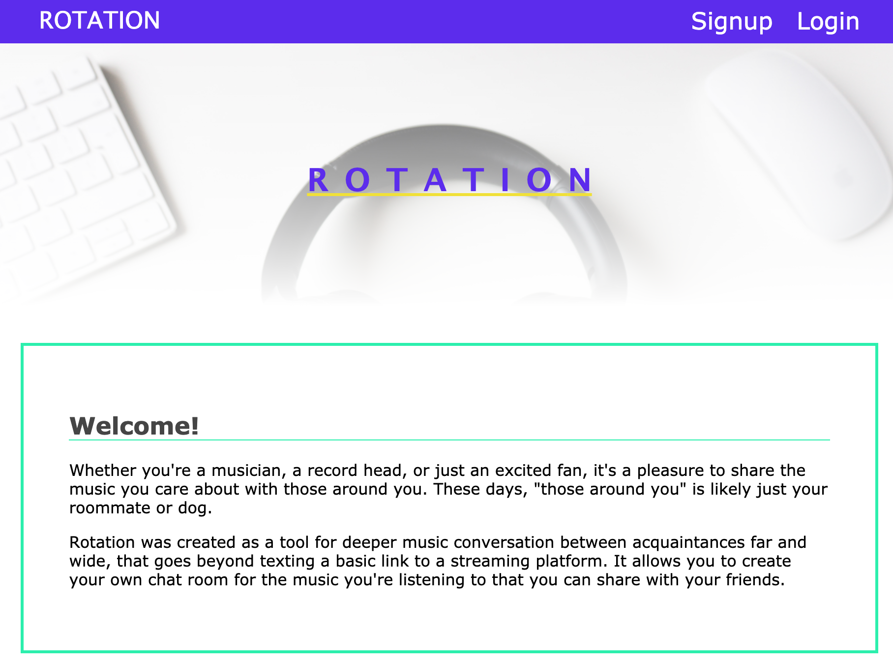

# Rotation Client

### Summary
[Live Demo](https://rotationexchange.com/)

API server: [Rotation API](https://github.com/Tarv44/rotation-api).

This is my first fullstack project that I've built. It allows users to have a common place to share and discuss music, regardless of what streaming platform they use.

### Technology used:
* React
* CSS
* Node

***

